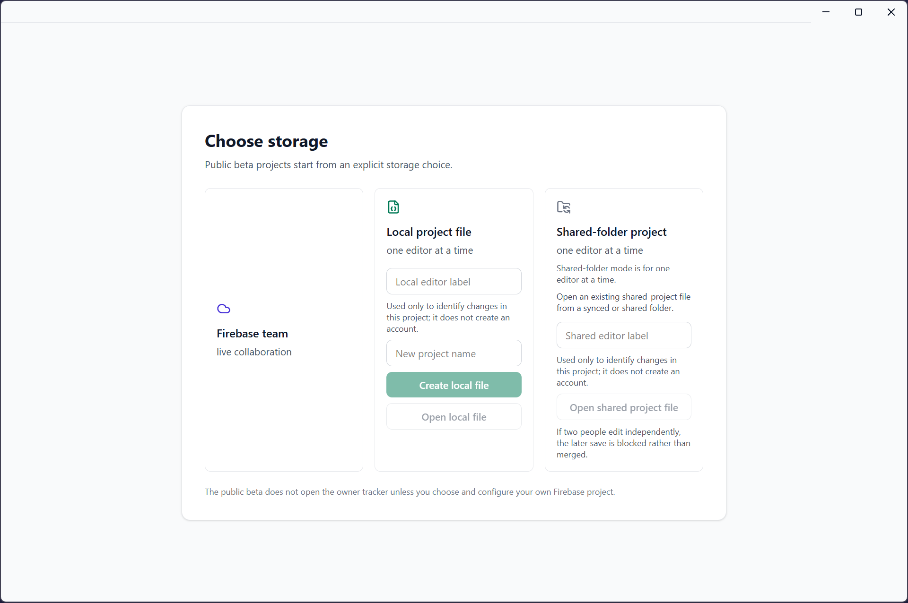
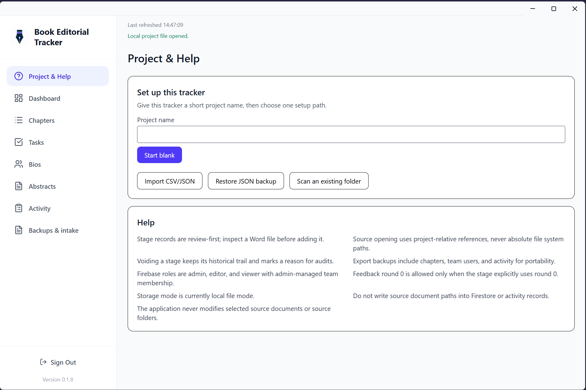
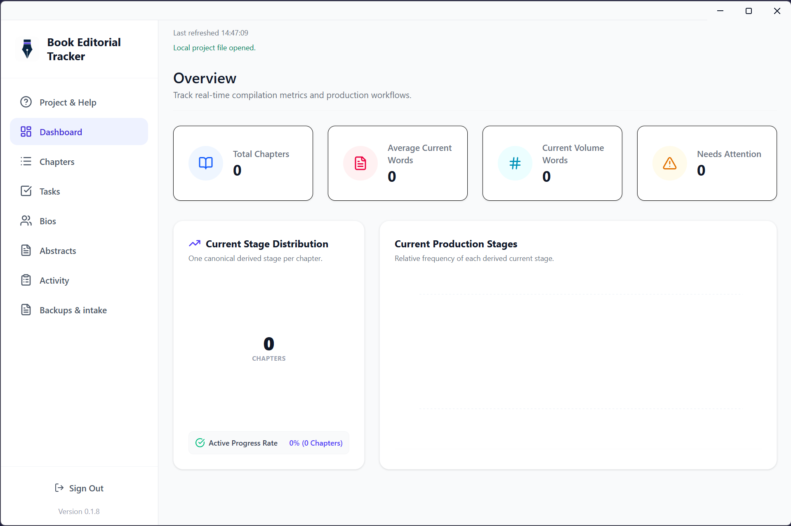
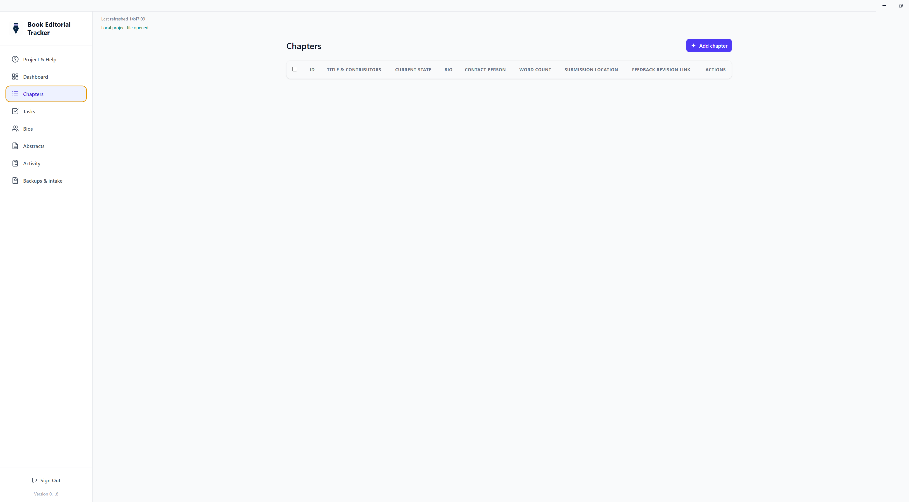
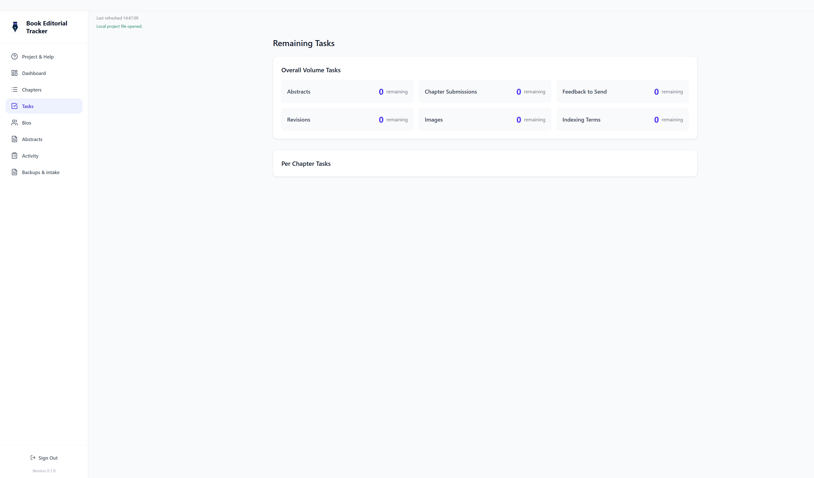
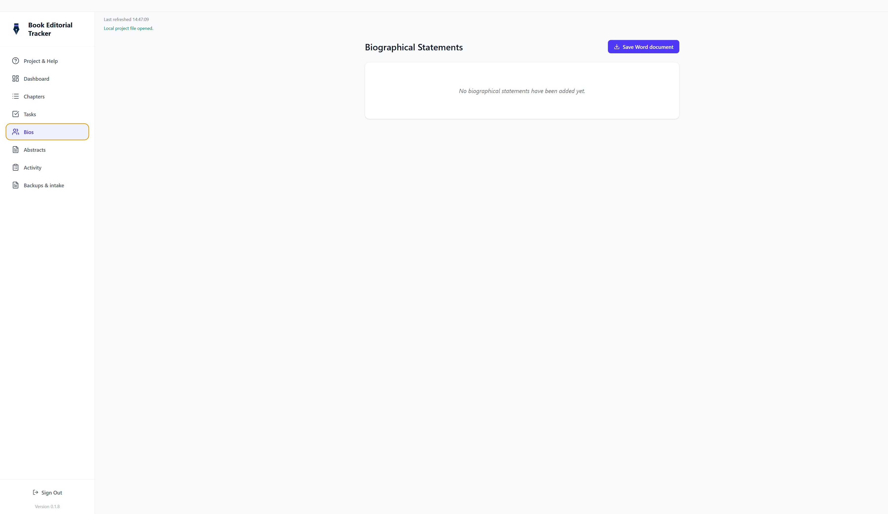
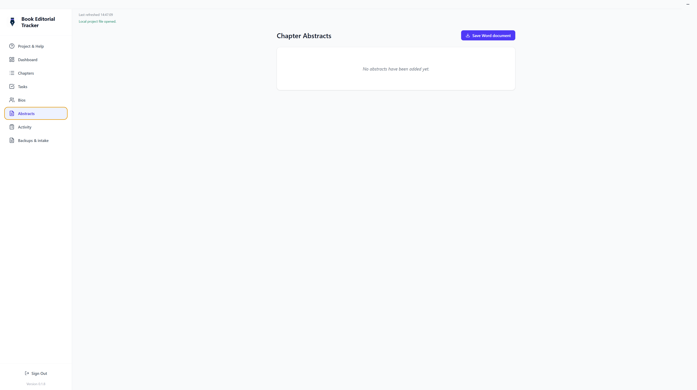
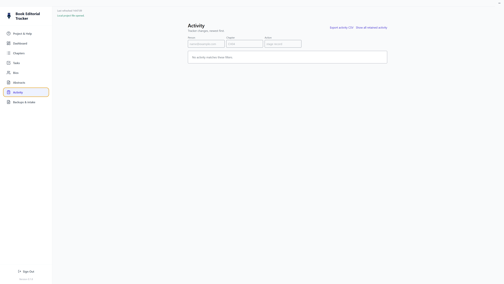
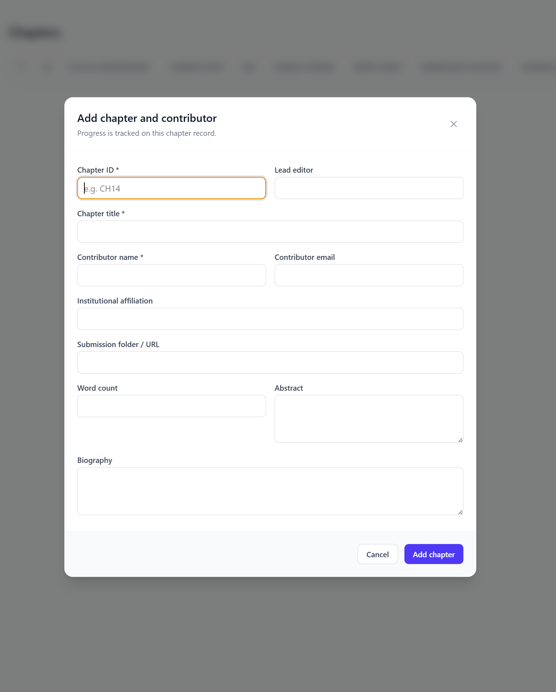

# Book Editorial Tracker

Book Editorial Tracker is a Windows desktop application for tracking chapter metadata, editorial workflow status, stage records, reviews, and audit history for a book or edited volume. The current public beta is an Electron application for Windows. Version 0.1.9 is the current release version in this repository.

This installer is a public beta, not a production release. It contains no owner Firebase configuration.

## Install and run

1. Download the verified public `Setup.exe` and checksum from the owner-managed release page.
2. Close any running copy of Book Editorial Tracker before launching the installer.
3. Run the installer and allow Windows prompts as needed.
4. Start Book Editorial Tracker from the installed shortcut or executable.
5. On first launch, choose a storage mode and continue with project setup.

## Storage choices

- Local project file: one editor at a time.
  The app stores tracker data in one portable project file. It does not copy Word files into that project file.
- Shared-folder project: one editor at a time; later conflicting saves are blocked, not merged.
  This mode uses a portable project file plus an advisory lock in a synced or shared folder. It does not provide live multi-user merging.
- Firebase team: live collaboration using the user's own Firebase project.
  Each user must create and operate their own Firebase project for this mode. The public installer does not connect to the owner tracker.

Local and shared project files contain tracker data only: project metadata, chapters, activity, and stage records. They do not embed or copy source Word documents or source folders.

## Screenshots

Choose a storage mode when the app opens:

The built-in Project & Help page explains setup paths and safety boundaries:

The dashboard shows the empty-project starting state:

The Chapters page starts empty until you add or import records:

Tasks begin empty for a new project:

Biographical statements are shown in their own workspace:

Abstracts are shown in their own workspace:

The Activity view records tracker changes and supports filtering/export:

Backups & intake provides import, scan, and reviewed inventory workflows. The public documentation deliberately does not show a real project scan, because scan rows can reveal project folder and document names.

Chapters can also be added manually with the chapter form:

## Source scanning and inventory creation

Source scanning is metadata-first. Selected source documents/folders are never edited, renamed, moved, or deleted by the application.

Inventory creation from scan is review-first:

- a scan proposes candidate chapter records;
- you review titles, contributors, IDs, and references first;
- chapter records are created only after you explicitly confirm `Create selected chapters`;
- the inventory flow never automatically imports stage records.

Scan results and tracker records store only safe project-relative references where supported. Absolute local manuscript paths are not written to tracker exports or Firebase activity.

## Importing chapters

Use **Download chapter-list template** in **Backups & intake** as the normal way to prepare an initial chapter list. Fill in the template, choose **CSV import**, review the preview, and confirm only the new records you want to add. This is the safest route because titles, contributors, contact details, abstracts, and biographies cannot be inferred reliably from folder or Word-file names.

Use **Scan an existing folder** as a separate, metadata-only aid: it identifies likely chapter IDs and lets you create a reviewed inventory. It never reads document content, changes source files, or automatically creates stage records.

## Manual stage records and source actions

Stage records are added manually from chapter detail views after a chapter already exists in the tracker. Inventory-from-scan creates chapter records only; it does not add abstract, manuscript, feedback, revision, or final-submission history automatically.

`Open document` and `Show in folder` work only when the relevant local source file or folder is available on the current machine. If the source is missing locally, the tracker preserves its metadata but cannot open the file for you.

## Firebase setup requirements

To use Firebase team mode in the public beta, you must:

1. create your own Firebase project;
2. enable Firebase Authentication;
3. enable Cloud Firestore;
4. configure the app with your own Firebase profile;
5. deploy the supplied [`firestore.rules`](./firestore.rules) to your own Firebase project.

The public installer contains no owner Firebase configuration, owner Firebase API key, or owner project binding.

## Backups, export, restore, and import limitations

- Local/shared project files and JSON backups contain tracker data, not copied Word files.
- Exported CSV and JSON files are recovery and reporting artifacts; they do not restore local file availability.
- Restore/import recreates tracker data only. It does not restore a saved local Firebase profile, local file tokens, or unavailable manuscript files.
- Shared-folder locking is advisory. It blocks later conflicting saves rather than merging them.

## Privacy, security, and beta caveats

- This is a Windows/Electron beta intended for careful manual use.
- The installer may trigger Windows SmartScreen because it is a beta desktop build.
- Local and shared-folder modes are one editor at a time.
- Shared-folder mode is not a live database and never auto-merges concurrent edits.
- Firebase team mode requires the user to secure and operate their own Firebase project.
- Source scans are read-only. The application does not modify selected source folders or source documents.

## More information

- [MIT License](./LICENSE)
- [Changelog](./CHANGELOG.md)
- [Release checklist](./docs/RELEASING.md)
